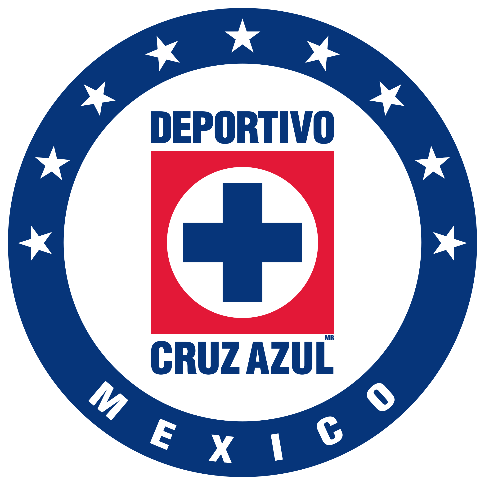

# Proyecto final Ingeniería de Software
---

Nuestro proyecto para el curso de ingeniería de software consiste en crear una aplicación para proponer proyectos al ITAM en dónde los y las alumnas pueden votar por los mejores proyectos. El objetivo del proyecto es realizar todo el ciclo de Ingeniería de Software con un proyecto web. Para llevarlo a cabo tuvimos que definir los Software Requirements, el plan de calidal, la arquitectura y la metodología que vamos a utilizar, y un plan económico. 

El resultado final del proyecto se puede consultar en la siguiente liga: [LA MAQUINA CEMENTERA](http://lamaquinacementera.com/)

## Tabla de contenidos
* [Integrantes](#integrantes)
* [Software requirements](#software-requirements)
* [Plan de calidad](#plan-de-calidad)
* [Arquitectura](#arquitectura)
* [Metodología](#metodología)
* [Propuesta económica](#propuesta-económica)
* [Contacto](#contacto)

## Integrantes 
- Rodrigo Gil 
- Miguel Quintero 
- José Gutierrez 
- Alexander Perelman 

## Software requirements
Los requerimientos del proyecto estan delineados en la siguiente [liga](softwareRequirement.md)

## Plan de calidad
Puedes encontrar el plan de calidad para la aplicación en el siguiente [enlace](softwareRequirement.md)

## Arquitectura
Utilizamos una arquitectura por capas en el diseño de nuestra aplicación. Si quieres conocer por qué, haz clic [aquí](arquitectura.md)

## Metodología
Utilizamos la metodología feature driven para nuestro proyecto, para saber más haz clic [aquí](metodologia.md)

## Propuesta económica
Puedes descargar nuestra propuesta económica utilizando la siguiente [liga](propuestaEconomicaxlsx.xlsx)

## Contacto
Este proyecto fue creado por 4 alumnos motivados del ITAM, estudiando ingeniería en computación.
Para más información, contactar a [@aperelman21](https://github.com/aperelman21/), [@MCMike0399](https://github.com/MCMike0399),[@ElChepeCodes](https://github.com/ElChepeCodes)  o [@rorode8](https://github.com/rorode8)

